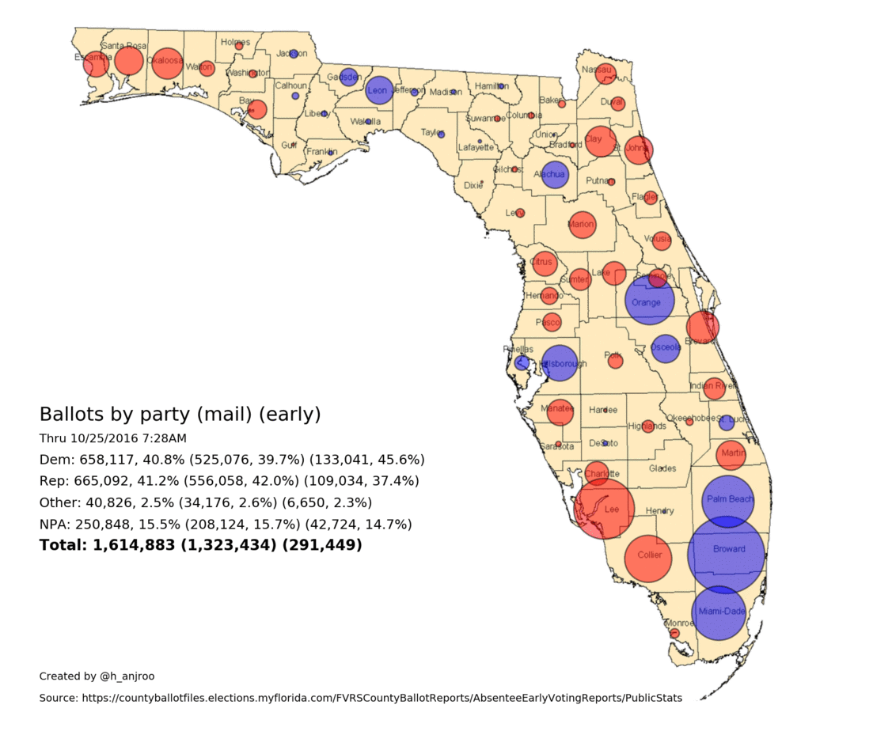

# floridaVote
A tool for scraping, tracking, and visualizing early and mail-in voting by county in Florida.

## Overview
This is one of my first Python projects. I put together this tool to scrape early and mail-in voting data from the [Florida Division of Elections](https://countyballotfiles.elections.myflorida.com/FVRSCountyBallotReports/AbsenteeEarlyVotingReports/PublicStats) to track early and mail-in ballots cast by party affilition. The script outputs a CSV report and an image which visualizes which party is leading in a given county. The area of the circle corresponds to the difference.

I used [QGIS](https://www.qgis.org/en/site/) to calculate the centroids of each county in Florida to use as input for the image generation. The data for the county map I used for the centroid calculations as well as the base layer for the vote visualization comes from the [Florida Geographic Data Library (FGDL)](https://www.fgdl.org/metadataexplorer/).

## Dependencies
- [numpy](https://numpy.org/)
- [matplotlib](https://matplotlib.org/)
- [scipy](https://scipy.org/)
